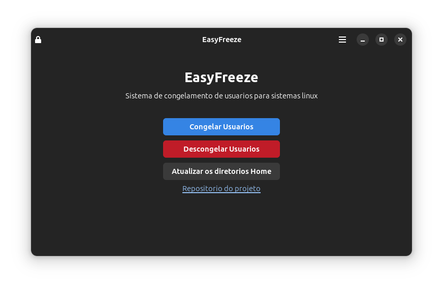

# EasyFreeze
### Sistema de congelamento para sistemas linux (debian e forks)

## Aparencia do programa:

## Objetivo
- [x] congelar o diretorio "/home" dos usuarios com um script
- [ ] script descongela
- [ ] script update /home
- [x] fazer uma gui para o script
- [ ] linkar os scripts aos botoes da gui
- [ ]  

## Ferramentas:
- <s>Gnome workbench</s>
- Gnome Builder

## Inspiração:
- https://www.udesc.br/arquivos/ceplan/id_cpmenu/1590/7172_16675008644336_1590.pdf
    - infelizmente não achei o projeto deles então vou fazer o meu kek
